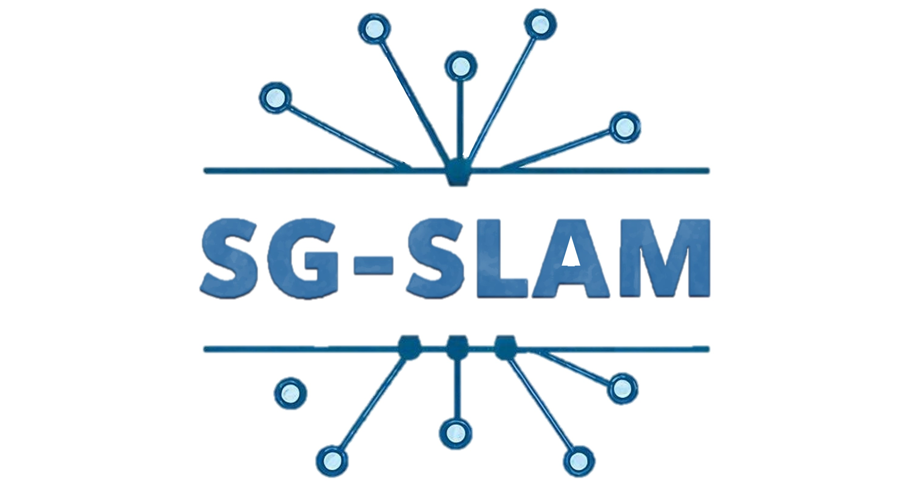

<div align="center">
     


# Leveraging Semantic Graphs for Efficient and Robust LiDAR SLAM

[](https://neng-wang.github.io/SG-SLAM/)  [](https://1drv.ms/v/c/5f06ab4eccad8a4e/Ebg7WRKoQRpInlFeTXhpiaYBN-F-GsGmPVdMhvdXtT44mw?e=ZAH8HQ)

</div>

This repo contains the implementation of our paper 

> **Leveraging Semantic Graphs for Efficient and Robust LiDAR SLAM**
>
> [Neng Wang](https://github.com/neng-wang), [Huimin Lu](https://scholar.google.com.hk/citations?hl=en&user=cp-6u7wAAAAJ), [Zhiqiang Zheng](https://ieeexplore.ieee.org/author/37280344700), [Hesheng Wang](https://irmv.sjtu.edu.cn/wanghesheng), [Yun-Hui Liu](https://scholar.google.com.hk/citations?user=WzmDQTMAAAAJ&hl=en), [Xieyuanli Chen](https://github.com/Chen-Xieyuanli)

*SG-SLAM is a semantic graph enhanced SLAM framework, which is  robust for pose estimation and capable of constructing globally consistent semantic map.*

## News:

- [2025-03] Code released.
- [2025-02] Submitted IROS 2025.


# 1. Introduction

## 1.1 Framework

<div align="center">
    <div align="center">
        
    </div>
    <font color=#a0a0a0 size=2>we propose a semantic graph-enhanced SLAM framework, named SG-SLAM, which effectively leverages the geometric, semantic, and topological characteristics inherent in environmental structures. The semantic graph serves as a fundamental component that facilitates critical functionalities of SLAM, including robust
relocalization during odometry failures, accurate loop closing, and semantic graph map construction. Our method employs a dual-threaded architecture, with one thread dedicated to online odometry and relocalization, while the other handles loop closure, pose graph optimization, and map update. This design enables our method to operate in real time and generate globally consistent semantic graph maps and point cloud maps.</font>
</div>

## 1.2 A related video

Our accompanying video is available on **[OneDrive](https://1drv.ms/v/c/5f06ab4eccad8a4e/Ebg7WRKoQRpInlFeTXhpiaYBN-F-GsGmPVdMhvdXtT44mw?e=ZAH8HQ)**.

<div align="center">
    <a href="https://1drv.ms/v/c/5f06ab4eccad8a4e/Ebg7WRKoQRpInlFeTXhpiaYBN-F-GsGmPVdMhvdXtT44mw?e=ZAH8HQ" target="_blank"></a>
</div>

# 2. Prerequisites

We tested our code on **ubuntu 20.04** and **ROS Noetic**
We have integrate the following dependency libraries into the [folder](./cpp/semgraph_slam/3rdparty)

- [Ceres](https://github.com/ceres-solver/ceres-solver)
- [Eigen](https://github.com/PX4/eigen)
- [Sophus](https://github.com/strasdat/Sophus)
- [tbb](https://github.com/uxlfoundation/oneTBB)
- [tsl_robin](https://github.com/Tessil/robin-map)

Additionally [GTSAM](https://github.com/borglab/gtsam) 4.0.3 needs to be installed on your machine.

# 3. Data

### 1. KITTI

You can download the point cloud dataset from the KITTI official [website](https://www.cvlibs.net/datasets/kitti/), as well as the labels from the semanticKITTI [website](http://semantic-kitti.org/). In our experiments, we use the labels from the SegNet4D. For the convenience, you can download from [here](https://1drv.ms/f/c/5f06ab4eccad8a4e/ErYFBreLgOZHqeWc2-WasIAB6sdME03IipgqzkYuRsTDZg?e=sL1yBr).

### 2. MulRAN

Download the dataset from the official [website](https://sites.google.com/view/mulran-pr/home).

### 3. Apollo

We use a subset of Apollo proposed by the [AutoMOS](https://github.com/PRBonn/auto-mos). You can download from [MapMOS](https://github.com/PRBonn/MapMOS?tab=readme-ov-file) repo.

# 4. Usage

### 4.1 Install

```bash
mkdir -p catkin_ws/src
cd catkin_ws/src
git clone git@github.com:nubot-nudt/SG-SLAM.git
cd ..
catkin build
source ~/catkin_ws/devel/setup.bash
```

### 4.2 running

Run the following commands for SLAM

```bash
roslaunch semgraph_slam semgraph_slam_kitti.launch # for kitti
roslaunch semgraph_slam semgraph_slam_mulran.launch # for mulran
roslaunch semgraph_slam semgraph_slam_apollo.launch # for apollo
```

Note that you should replace `lidar_path` and `label_path` with your own.

**SLAM Performance Evaluation**

```bash
cd eval
python traj_eval.py --gt_file ./ground_truth_pose/00.txt --pred_file ../save/kitti_slam_00.txt --calib_file /path/to/calib/00/calib.txt
```

### 4.3 Relocalization Demo

Download our relocalization demo data form this [link](https://1drv.ms/f/c/5f06ab4eccad8a4e/EpplD67KAHtFgun_qfpvDVABjSj9wHFooYLXCZIPetUS3w?e=cAhmo1), or create your own dataset by randomly removing 10 consecutive frames.

Run the following commands for odometry with relocalization.

```bash
roslaunch semgraph_slam semgraph_slam_relocalization.launch
```

You can observe the relocalization results from rviz.

# Our related work

- [SegNet4D](https://github.com/nubot-nudt/SegNet4D), a 4D semantic segmentation method.
- [SGLC](https://github.com/nubot-nudt/SGLC), a semantic graph guided loop closing method.

# Acknowledgments

We would like to express our sincere gratitude for the following open-source work that has been immensely helpful in the development of SG-SLAM.

- [KISS-ICP](https://github.com/PRBonn/kiss-icp): KISS-ICP: In Defense of Point-to-Point ICP Simple, Accurate, and Robust Registration If Done the Right Way.

- [CVC-Cluster](https://github.com/wangx1996/Lidar-Segementation): Curved-Voxel Clustering for Accurate Segmentation of 3D LiDAR Point Clouds with Real-Time Performance.

# **License**

This project is free software made available under the MIT License. For details see the LICENSE file.
